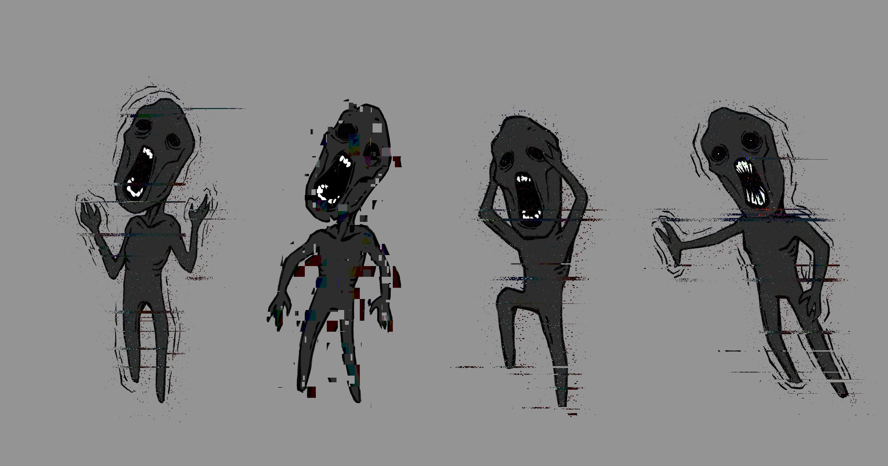

# Ennemis

Owner: Ethan CHAINTRON, Thomas LICATA
Verification: Expired
Tags: Design, Gameplay
Status: Done

# Histoire

Suite aux cataclysmes provoqués par la guerre de nombreux hommes ont muté avec les radiations ambiantes. De plus, certaines expériences effectuées dans le bunker ont affecté les formes de vies présentes.

Ces aberrations sont au-delà de notre monde et naviguent dans un plan immatériel grâce aux ondes radios. Ils se cachent, invisible à nos yeux, mais détectables par une radio. Cela en fait des monstres redoutables et insensible aux armes classiques.

# Visuels

# Liste ennemis

[Le brouilleur d’ondes](Le%20brouilleur%20d%E2%80%99ondes%204d2963d3aebf4165b34142cf832b6490.md)