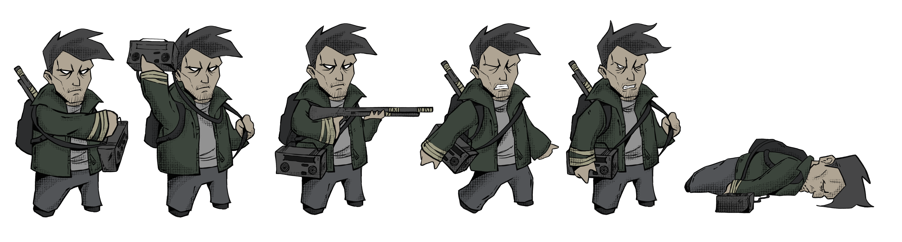

# Ivanov Belinski

Owner: Ethan CHAINTRON, Thomas LICATA
Verification: Expired
Tags: Entities, Gameplay
Status: Done

# Histoire

Ivanov Belinski est un ancien opérateur radio au service du gouvernement URSS. Suite à l’explosion des bombes nucléaires en 1983, il a fui la terre pour se réfugier dans un bunker de survie. 

Cependant, il se retrouve séparé de sa fille en fuyant la guerre. Depuis, il ne vit que dans l’espoir de la retrouver. Il use de ses talents et de sa connaissance dans la radio pour chercher un potentiel signal de détresse.

# Compétences

Ivanov peut utiliser sa [radio](Radio%201b921ee4355d814f8239c0471d8706d9.md) pour se battre. Grâce à elle, il peut :

- Détecter les [ennemis](Ennemis%201b921ee4355d8070b3f0ee80e3efb429.md)
- Les sortir du monde immatériel
- Se battre contre les monstres
- Interagir avec l’environnement

Ces actions utilisent une certaine quantité de [batterie](Radio%201b921ee4355d814f8239c0471d8706d9.md) (qui correspond à la vie du joueur). Ainsi, chaque utilisation de la radio doit être réfléchie pour ne pas gaspiller sa précieuse électricité.

# Visuel

