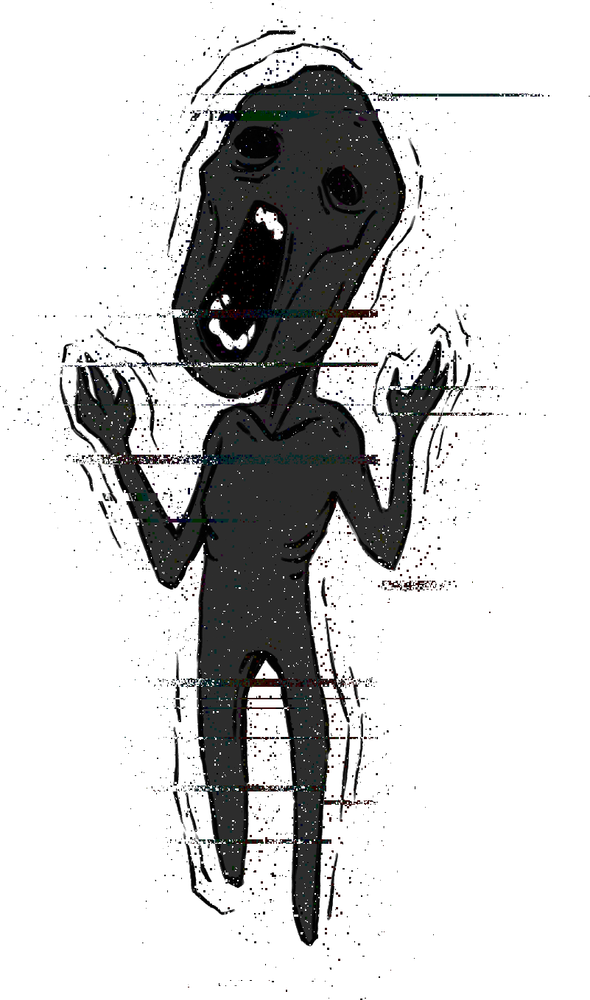

# Le brouilleur d’ondes

Owner: Ethan CHAINTRON, Thomas LICATA
Verification: Expired
Tags: Entities, Gameplay
Status: Done

Le brouilleur d’onde est une abomination qui a le pouvoir de brouiller les ondes envoyées par Ivanov.

# Origine

Il est né des radiations provoquées par la catastrophe de 1983, c’est un humain s’étant transformé en ce qu’il est aujourd’hui.

# Capacité

Le brouilleur d’onde a la capacité de brouiller son onde, ce qui empêche le joueur de savoir la vie qui lui reste et la puissance de la prochaine attaque qu’il envoie, ce qui rend l’anticipation plus compliquée pour le joueur.

# Visuel

