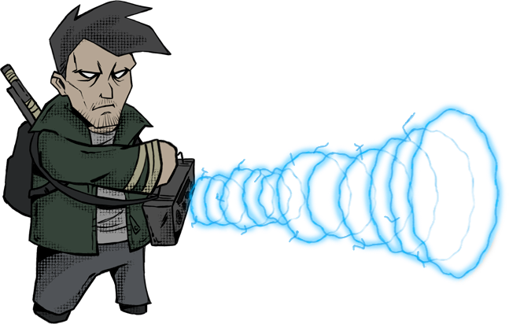

# Radio

Owner: Ethan CHAINTRON, Thomas LICATA
Verification: Expired
Tags: Design, Gameplay
Status: Done

La radio est l’outil primordial d’Ivanov, il ne se sépare jamais de celle-ci et lui permet de survivre dans son aventure au cœur du bunker. 

# Visuel

.png)

# Fonctionnement global

Étant un ex-opérateur radio de l’URSS, [Ivanov](Ivanov%20Belinski%2019021ee4355d80339a82f32c11a82668.md) est intraitable dans les domaines concernant l’électromagnétisme et la radiographie. Sa fidèle radio l’accompagne depuis toujours et lui permet de se sortir de situations délicates comme certaines qu’il a pu connaitre dans le passé.

La radio constitue l’organe principal du jeu, le cœur du gameplay. Ivanov s’en sert durant toute son aventure et elle accompagne le joueur tout au long de son épopée dans le [bunker](Bunker%201b821ee4355d805997a0c7c6f2d4c0c9.md).

Elle est composée de plusieurs modules réservés à différents usages : 

[L’oscillation du joueur](Radio%201b921ee4355d814f8239c0471d8706d9.md) permettant d’amplifier son attaque et de la faire correspondre avec celles des ennemis

[L’oscillation ennemie](Radio%201b921ee4355d814f8239c0471d8706d9.md) qui donne des informations sur la vie restante de celui-ci, et sur la puissance de l’attaque qu’il va envoyer.

[La fréquence](Radio%201b921ee4355d814f8239c0471d8706d9.md) qui permet à Ivanov d’utiliser divers effets durant l’exploration et de choisir son attaque parmi un large panel disponible lors d’un combat contre un ennemi.

[Le scanner](Radio%201b921ee4355d814f8239c0471d8706d9.md) permettant de détecter des monstres en amont de la rencontre avec eux et de faire apparaitre leur oscillation.

Et enfin, [la batterie](Radio%201b921ee4355d814f8239c0471d8706d9.md), qui représente la vie du héros et ajoute une gestion de celle-ci lors de l’utilisation de différents modules.

Le joueur se sert de la radio durant tout le jeu, il apprend au fil de l’aventure à s’en servir de manière optimale et de la gérer comme bon lui semble.

La gestion de l’énergie, l’optimisation dans les choix des fréquences, l’habilité à se servir des oscillations, le joueur forge ces compétences au fil de l’aventure et voit sa progression grimper.

La maîtrise de cette radio est une mission satisfaisante et primordiale dans Last Signal !

# Oscillation du joueur

L’oscillation du joueur est un outil qui est modulable par celui-ci, c’est-à-dire que le joueur peut modifier cette oscillation à son avantage, ou pas !

# Visuel

.gif)

# Exploration

Dans le cadre de l’exploration, c’est-à-dire toute phase hors combat, l’oscillation se combine avec le [Scanner](Radio%201b921ee4355d814f8239c0471d8706d9.md) qui va détecter les [oscillations ennemies](Radio%201b921ee4355d814f8239c0471d8706d9.md), avec lesquelles le joueur doit faire correspondre la sienne avec celles des ennemis.

## Fonctionnement

Grâce à des boutons situés à côté de l’oscillation du joueur, celui-ci peut la modifier afin de correspondre à celles des ennemis, lorsque les deux oscillations correspondent, l’ennemi relié à son oscillation va sortir du monde immatériel, ce qui va le faire apparaître dans le monde du joueur et le rendre visible, ce qui va impacter le combat sous certaines conditions :

Si Le joueur [détecte](Radio%201b921ee4355d814f8239c0471d8706d9.md) l’ennemi et fait correspondre son oscillation avec celle de son adversaire, il va donc le confronter avec un avantage.

Si le joueur a détecté l’ennemi, mais n’a pas fait correspondre son oscillation avec celle de son adversaire, il va le confronter sans avantage ni désavantage.

Cependant, si le joueur n’a pas détecté l’ennemi et donc n’a pas pu faire correspondre son oscillation avec celle de son adversaire, il va le confronter avec un désavantage.

# Combat

Le combat se déclenche lorsqu’un ennemi et le joueur rentre en collision.

L’oscillation joue un rôle important dans la balance du risk/reward lors de l’attaque du joueur.

## Fonctionnement

Lorsque le joueur choisit la [fréquence](Radio%201b921ee4355d814f8239c0471d8706d9.md) avec laquelle il veut attaquer, l’oscillation du joueur lui permet de modifier son attaque en l’amplifiant.

## Visuel

L’amplification augmente les dégâts, mais peut provoquer une surcharge, infligeant des dégâts à [Ivanov](Ivanov%20Belinski%2019021ee4355d80339a82f32c11a82668.md).

## Visuel

.png)

# Oscillation ennemie

Les ennemis possèdent également une oscillation présente sur la radio d’Ivanov 

# Visuel

Elle possède plusieurs usages : 

# Exploration

Lors de la phase d’exploration, c’est-à-dire toute phase hors combat, L’oscillation est liée au Scanner, qui va permettre d’afficher celle-ci sur la radio.

La ou les oscillations qui s’affichent sur la radio seront fixes et ne changeront pas, le but pour le joueur étant de faire correspondre la sienne avec celles de ses ennemis.

# Combat

Lors d’un combat, l’oscillation est à usage informatif, elle indique la vie de l’ennemi : si l’oscillation est forte et rapprochée, l’ennemi possède beaucoup de vie, à l’inverse, si l’oscillation est faible et est plus plate, l’ennemi n’a plus beaucoup de vie.

Cette oscillation indique également la puissance de la prochaine attaque ennemie : si l’oscillation est forte et rapprochée, l’ennemi va effectuer une attaque lourde, à l’inverse, si l’oscillation est faible et est plus plate, l’ennemi va lancer une attaque légère.

# Scanner d’amplitudes (AM/FM)

Le scanner est une capacité de la radio à pouvoir détecter les ennemis et permettre à [Ivanov](Ivanov%20Belinski%2019021ee4355d80339a82f32c11a82668.md) de les sortir de leur monde afin de les amener dans le sien. Il permet également d’afficher les oscillations ennemies sur la radio d’Ivanov afin qu’il les fasse correspondre avec son [oscillation](Radio%201b921ee4355d814f8239c0471d8706d9.md).

# Visuel

Lorsqu’un ennemi est détecté par le scanner, son [oscillation](Radio%201b921ee4355d814f8239c0471d8706d9.md) s’affiche sur la radio d’Ivanov, il ne lui reste plus qu’à faire correspondre son [oscillation](Radio%201b921ee4355d814f8239c0471d8706d9.md) avec celles des ennemis détectés.

# Fonctionnement

# Scan AM

Le scan AM permet d’envoyer une onde de reconnaissance dans une direction rectiligne, soit devant Ivanov, soit derrière lui. Assez économique en termes de batterie, il est cependant moins efficace que le scan FM.

L’onde envoyée va détecter les ennemis devant ou derrière Ivanov, mais son efficacité n’est pas sans faille, de 0 à 15 mètres, son taux de détection est de 80%, au-delà de 15 mètres, son taux de détection est de 50%. 

Le scan AM coûte 5% de batterie 

## Visuel

# Scan FM

Le scan FM permet d’envoyer une onde de reconnaissance dans une direction circulaire, autour d’Ivanov. Il est en globalité plus efficace que le scan AM, mais coûte plus cher.

L’onde envoyée va détecter les ennemis autour d’Ivanov, mais son efficacité n’est pas sans faille aussi, de 0 à 10 mètres, son taux de détection est de 90%, de 10 mètres à 15 mètres son taux de détection est de 60%, et au-delà de 15 mètres, son taux de détection est de 30%.

Le scan AM coûte 15% de batterie 

## Visuel

.png)

Les ennemis non détectés sont donc des défis de taille pour Ivanov !

# Fréquences

Un des modules présents sur la radio sont les fréquences, un sélecteur de fréquence se trouve sur celle-ci et possèdent différents usages selon les situations.

# Visuel

# Exploration

Lors des phases d’exploration, c’est-à-dire toute phase hors combat, les fréquences sont disponibles en guise d’outils pour permettre à [Ivanov](Ivanov%20Belinski%2019021ee4355d80339a82f32c11a82668.md) de se protéger ou d’appliquer différents effets.

## Fonctionnement

Lors d’une phase d’exploration, Ivanov peut par exemple se servir d’une fréquence qui va le protéger des attaques des ennemis non-détectés.

# Visuel

# Combat

Lors d’un combat contre un ennemi, le sélecteur de fréquence est tout simplement le panel d’attaque d’Ivanov, chaque fréquence possède ses propres dégâts et ses statuts infligés, chaque fréquence peut-être amplifiée grâce à [l’oscillation du joueur](Radio%201b921ee4355d814f8239c0471d8706d9.md).

## Fonctionnement

Lorsque vient le tour d’Ivanov, le joueur choisit une fréquence avec laquelle il attaque l’ennemi, il choisit ensuite si il veut [amplifier](Radio%201b921ee4355d814f8239c0471d8706d9.md) son attaque ou non. Lorsque le joueur a choisit sa fréquence et sa potentielle amplification, il lance l’attaque, infligeant des dégâts (et son statut si la fréquence en possède un).

# Batterie

La batterie est l’élément essentiel de la [radio](Wiki%2019021ee4355d80acaed0ca6f64ac138f.md). Elle constitue la jauge de vie d’ [Ivanov](Ivanov%20Belinski%2019021ee4355d80339a82f32c11a82668.md) mais aussi l’énergie qu’il peut utiliser pour effectuer les actions de sa radio (attaques, effets, etc…).

## Visuel

## Fonctionnement

La batterie à une capacité de 0 à 100 ce qui correspond au pourcentage de charge. La batterie peut être changée ou rechargée en utilisant des [piles](Pile%201b821ee4355d80ce86acf4741c847ac5.md). Lors d’un combat, les [ennemis](Wiki%2019021ee4355d80acaed0ca6f64ac138f.md) infligent des dégâts à la batterie et si elle tombe à 0%, Ivanov meurt et le joueur perd la partie.

De plus, les différentes actions que peuvent effectuer le joueur avec sa radio comme la détection de signal et le lancement d’attaques requiert de l’énergie. Ainsi, le joueur draine sa propre vie pour progresser et doit gérer son énergie pour ne pas succomber.