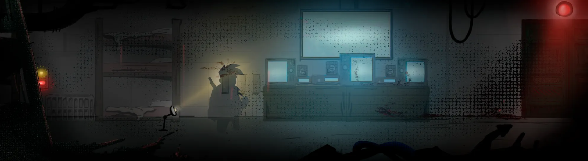

# Étages

Owner: Ethan CHAINTRON, Thomas LICATA
Verification: Expired
Tags: Entities, Gameplay, items
Status: Done

Les étages sont les différents niveaux du [bunker](Bunker%201b821ee4355d805997a0c7c6f2d4c0c9.md) que le joueur va parcourir durant le jeu.

Ils sont composés de différentes [salles](Salles%201b821ee4355d80a88d04ed95cbce28bf.md) que le joueur peut parcourir, à ses risques et périls.

Les étages sont tous différents, ils possèdent leurs propres environnements et retracent l’histoire de ce macabre [bunker](Bunker%201b821ee4355d805997a0c7c6f2d4c0c9.md), voici les différents environnements disponibles.

# Liste des étages

<aside>

Cette section n’est pas encore implémentée, mais étant fixée, elle explique le futur fonctionnement de ce système.

</aside>

| Étages | Salles |
| --- | --- |
| **1 - Entrée du Bunker** | • Système de verrouillage
• Bureau du directeur
• Salle de commandement |
| **2 - Lieux de vie** | • Dortoir
• Réfectoire
• Cuisine
• Vestiaire
• Douche |
| **3 - Production de ressource** | • Usine
• Serre
• Armurerie |
| **4 - Radio** | • Salle des radars
• Émetteur
• Salle de contrôle
• Salle des machines |
| **5 - Laboratoire** | • Infirmerie
• Salle de test
• Labo de recherche
• Morgue |

# Exemple de visuel

